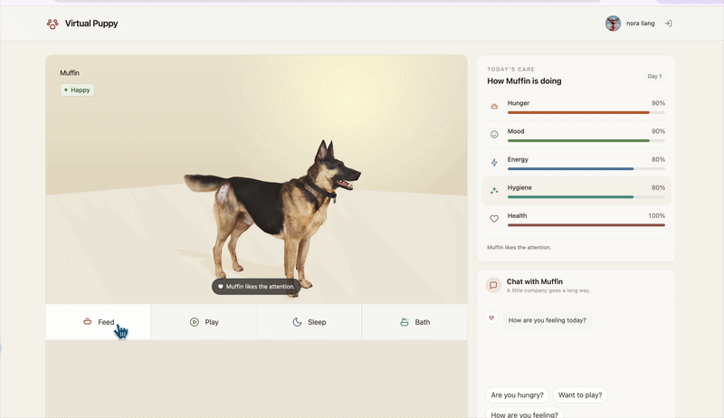

# Virtual Puppy

[](https://github.com/lnuo026/virtual-puppy/actions/workflows/ci.yml)


A full-stack virtual pet application where persistent pet state, a reactive 3D
scene, and Gemini-powered chat create a living companion experience.

[Live Demo](https://puppy.lnuo.me) ·
[API Health](https://api-puppy.lnuo.me/health) ·
[Source Code](https://github.com/lnuo026/virtual-puppy)



## What You Can Experience

- Sign in with Google and meet a uniquely generated puppy.
- Care for it by feeding, playing, letting it sleep, or giving it a bath.
- See its hunger, mood, energy, hygiene, health, and derived status update.
- Explore a 3D scene whose lighting and care hints react to the puppy's state.
- Chat with a Gemini-powered companion that receives its current server-side
  condition, breed, and personality as context.
- Return on another device and continue caring for the same puppy.

## Built Around Real State, Not Frontend Illusions

Pet creation, offline decay, daily check-ins, status derivation, and interaction
updates are handled by the NestJS API and persisted in MongoDB.

The React client renders the state returned by the server instead of deciding
what the puppy's condition should be. This keeps pet state consistent across
sessions and prevents client-side values from becoming the source of truth.

## Engineering Highlights

### Server-authoritative pet lifecycle

A puppy is generated lazily by the backend for the authenticated user. The API
calculates offline decay from persisted timestamps before returning the latest
state, so a pet cannot be recreated or manipulated by changing browser data.

### State priority and UI truth

`status` is a derived, priority-based label: a sick puppy can still be sleeping,
but `sick` may take precedence as the displayed status. The frontend therefore
uses the underlying `sleepUntil` timestamp when it needs to determine whether
the sleep action is active, instead of treating one derived label as every
possible fact about the pet.

### AI context stays on the server

Gemini is called only from the backend. The API key never reaches the browser,
and the prompt is built from server-derived pet context rather than state
submitted by the client.

## Engineering Decisions

### Trust the server, not the browser

The API owns pet creation, offline decay, care actions, and status derivation.
The client renders the resulting state, which keeps pet progress consistent
across sessions and devices.

### Keep AI context and secrets off the client

The backend reads the current pet record and builds Gemini context
server-side. This prevents the browser from supplying authoritative pet state
or receiving the Gemini API key.

### Verify delivery after deployment

GitHub Actions runs linting, tests, and builds before deployment. The backend
image is published to GitHub Container Registry, deployed to EC2 through AWS
Systems Manager, and checked through the production health endpoint.

## Tech Stack

- Frontend: React, TypeScript, Vite, Tailwind CSS, Zustand, Axios
- 3D: Three.js, React Three Fiber, React Three Drei
- Backend: NestJS, Mongoose, MongoDB Atlas
- Authentication: Google OAuth 2.0, JWT, httpOnly cookies
- AI: Google Gemini API
- Delivery: Docker, GitHub Actions, GitHub Container Registry, AWS EC2, AWS SSM,
  Nginx, Vercel

## Local Setup

### Prerequisites

- Node.js 24
- A MongoDB Atlas connection string
- A Google OAuth web application
- A Gemini API key

### Backend

Create `app/backend/.env` with values for:

```text
MONGODB_URI
GOOGLE_CLIENT_ID
GOOGLE_CLIENT_SECRET
GOOGLE_CALLBACK_URL
JWT_SECRET
FRONTEND_URL
GEMINI_API_KEY
```

Then run:

```bash
cd app/backend
npm install
npm run start:dev
```

### Frontend

```bash
cd app/frontend
cp .env.example .env
npm install
npm run dev
```

For local development, set `VITE_API_BASE_URL=http://localhost:3000` in
`app/frontend/.env`.

## Roadmap

- Enrich the adoption ceremony with a more cinematic reveal.
- Give AI conversations stronger continuity from recent pet interactions.
- Show a return-summary card based on real offline state changes.
- Add a persistent seven-day growth timeline backed by server-side snapshots.

## Project Structure

```text
virtual-puppy/
├── package.json                  # Root npm run dev command for both apps
├── app/
│   ├── frontend/                 # React, Vite, Three.js client
│   │   ├── src/
│   │   │   ├── api/              # Auth, pet, and chat HTTP clients
│   │   │   ├── components/       # 3D scene, adoption, chat, and UI components
│   │   │   ├── pages/            # Login and protected home screens
│   │   │   ├── store/            # Zustand user and pet state
│   │   │   └── router/           # Route protection
│   │   └── public/               # 3D pet assets and the favicon
│   └── backend/                  # NestJS API
│       └── src/
│           ├── common/           # Guards, decorators, logging, filters
│           ├── config/           # Environment validation
│           ├── health/           # Health endpoint
│           └── modules/
│               ├── auth/         # Google OAuth and JWT
│               ├── chat/         # Gemini integration and prompt building
│               ├── pet/
│               │   ├── dto/      # Pet request validation
│               │   ├── lib/      # Generation, decay, check-ins, and state logic
│               │   │   ├── stateMachine.ts       # Derived status priority rules
│               │   │   └── stateMachine.spec.ts  # Status-priority unit tests
│               │   ├── schemas/  # Persisted pet model
│               │   └── pet.service.ts
│               └── user/         # User model and profile endpoints
├── infra/docker/                 # Dockerfile and production Compose config
└── .github/workflows/            # CI and CD workflows
```
in progress

## Credits

The 3D dog models used in this project are licensed under
[CC BY 4.0](https://creativecommons.org/licenses/by/4.0/) and used unchanged.

- [Riley](https://sketchfab.com/3d-models/riley-8aedf051c5714409a1171ceed6543644)
  by [3D Resource](https://sketchfab.com/lopuh22721)
- [Labrador Dog](https://sketchfab.com/3d-models/labrador-dog-1f56cfbab07e4fe49b5d9e521c82073a)
  by [kenchoo](https://sketchfab.com/kenchoo)
- [Patient Pup Dog](https://sketchfab.com/3d-models/patient-pup-dog-1c6e0eb7ae554a0ba9267b2e173fc6b5)
  by [restore50](https://sketchfab.com/restore50)
- [Guardian dog 3d model free](https://sketchfab.com/3d-models/guardian-dog-3d-model-free-63e0b55092a04203a0f075d034ded549)
  by [iRahulRajput](https://sketchfab.com/rt699448)
