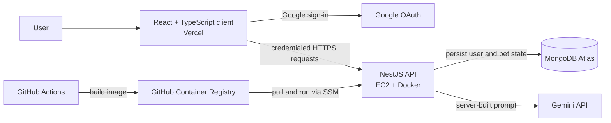

# Virtual Puppy

[](https://github.com/lnuo026/virtual-puppy/actions/workflows/ci.yml)


Virtual Puppy is a deployed full-stack AI companion app. Users sign in with
Google, receive one persistent 3D puppy, care for it over time, and chat with
it through a state-aware Gemini integration.

[Open the app](https://puppy.lnuo.me) ·
[Check API health](https://api-puppy.lnuo.me/health) ·
[View source](https://github.com/lnuo026/virtual-puppy)


## The Problem

A virtual pet only feels continuous when its condition is trustworthy after a
user returns. Browser-only state can reset between sessions, vary by device,
or be altered before an interaction reaches the API. AI chat has the same
problem: a reply should reflect the pet's actual condition without exposing an
AI key or accepting authoritative pet data from the browser.

Virtual Puppy addresses these concerns with a server-authoritative lifecycle.
The client provides the interactive experience; the API owns the pet record,
time-based calculations, and AI context.

## What Users Can Do

- Sign in through Google OAuth and receive one randomly generated puppy.
- Care for the puppy by feeding, playing, letting it sleep, and bathing it.
- Track hunger, mood, energy, hygiene, health, check-in streaks, and daily
  care progress.
- Return after time away and see server-calculated offline decay.
- Interact with one of four persisted 3D dog models: German Shepherd,
  Labrador, Chinese Village Dog, or Mastiff.
- See scene lighting and care hints respond to the puppy's derived state.
- Rename the puppy and continue its progress across signed-in sessions.
- Chat with a Gemini-powered companion whose personality and current condition
  are supplied by the server.

## Architecture



The frontend is a React/Vite application using Zustand for client state and
React Three Fiber for the 3D scene. The backend is a NestJS API with MongoDB
for persistent user and pet records. Google OAuth issues a JWT stored in an
httpOnly cookie, so the browser does not manage the session token directly.

## Engineering Decisions

### The API is the source of truth for pet lifecycle

The backend creates a pet lazily for the authenticated user and persists one
pet document per user. Before it returns a pet or processes a care action, it
applies elapsed-time decay from the saved `lastVisitAt` timestamp, updates
daily check-in state, derives the current status, and saves the result.

This prevents the browser from deciding health or progress. A user can switch
devices and receive the same persisted pet state rather than a separate
browser-local version.

### Status is derived, prioritised state

`status` is a display-oriented result derived from the underlying values rather
than an independent UI flag. The state machine gives health risk priority over
sleep, then hunger, tiredness, and mood. It also uses separate sick-entry and
sick-exit thresholds, so a pet does not flicker in and out of the `sick` state
near one boundary.

The client checks `sleepUntil` when it needs to know whether sleeping is still
active, instead of assuming the displayed status contains every fact about the
pet.

### AI context and secrets stay on the server

The chat request contains only a bounded recent conversation. NestJS loads the
authenticated user's pet, calculates its current condition, builds the Gemini
system instruction from trusted values, and calls Gemini from the server.
`GEMINI_API_KEY` is never sent to the browser.

### Security controls are applied at the API boundary

- Helmet adds HTTP security headers.
- CORS permits the configured frontend origin and credentialed requests.
- An Origin guard rejects non-safe requests whose `Origin` does not exactly
  match `FRONTEND_URL`; this adds protection for cookie-authenticated write
  operations.
- A global validation pipe strips unknown fields and rejects unexpected input.
- JWT authentication is the default for routes; only explicitly marked routes
  are public.
- The default API limit is 60 requests per minute, while `/chat` is limited to
  5 requests per minute.

### Delivery is automated and observable

The repository separates CI from CD. CI runs backend linting, tests, and a
production build, plus frontend linting and a production build. After a
successful CI workflow on `main`, CD builds the backend Docker image, publishes
it to GitHub Container Registry, runs deployment commands through AWS Systems
Manager, and polls the public health endpoint.

The public app and health endpoint were manually checked when this README was
updated; the health response reported MongoDB as `up`.

## API Surface

All routes except the Google OAuth flow and health check require the
cookie-backed JWT session.

- `GET /health` — Terminus health check, including MongoDB connectivity.
- `GET /auth/google` and `GET /auth/google/callback` — Google OAuth sign-in.
- `GET /auth/logout` — clears the session and returns to the login page.
- `GET /users/profile` — returns the signed-in user profile.
- `GET /pet` — gets or creates the current user's pet, applies offline decay,
  and evaluates the daily check-in.
- `POST /pet/feed`, `POST /pet/play`, `POST /pet/sleep`, `POST /pet/bath` —
  perform care actions and return the saved pet state.
- `PATCH /pet/rename` — updates the pet name.
- `POST /chat` — accepts up to 20 validated recent messages and returns a
  Gemini reply based on trusted pet context.

## Tech Stack

- Frontend: React, TypeScript, Vite, Tailwind CSS, Zustand, Axios
- 3D: Three.js, React Three Fiber, React Three Drei
- Backend: NestJS, Mongoose, MongoDB Atlas, Joi, Terminus, Winston
- Authentication: Google OAuth 2.0, JWT, httpOnly cookies
- AI: Google Gemini API
- Delivery: Docker, GitHub Actions, GitHub Container Registry, AWS EC2, AWS
  Systems Manager, Nginx, Vercel

## Run Locally

### Prerequisites

- Node.js 24
- A MongoDB Atlas connection string
- A Google OAuth web application configured with a local callback URL
- A Gemini API key

### 1. Configure the backend

Create `app/backend/.env`:

```text
MONGODB_URI=
GOOGLE_CLIENT_ID=
GOOGLE_CLIENT_SECRET=
GOOGLE_CALLBACK_URL=http://localhost:3000/auth/google/callback
JWT_SECRET=
FRONTEND_URL=http://localhost:5173
GEMINI_API_KEY=

# Optional
PORT=3000
NODE_ENV=development
JWT_EXPIRES_IN=7d
GEMINI_MODEL=gemini-2.5-flash
```

In Google Cloud, add the same callback URL to the OAuth client's authorised
redirect URIs.

### 2. Configure the frontend

```bash
cd app/frontend
cp .env.example .env
```

`app/frontend/.env` should contain:

```text
VITE_API_BASE_URL=http://localhost:3000
```

### 3. Install and start both applications

From the repository root:

```bash
npm install
npm install --prefix app/backend
npm install --prefix app/frontend
npm run dev
```

The root command starts the API first, waits for `http://127.0.0.1:3000/health`,
then starts Vite. Keep that terminal open while developing.

Alternatively, use two terminals:

```bash
cd app/backend
npm run start:dev
```

```bash
cd app/frontend
npm run dev
```

## Verification

The automated backend tests focus on deterministic business rules: time-based
decay, sleep completion, stat clamping, health changes, daily check-in streaks,
daily care reset, and status-priority behaviour.

Run the same checks locally:

```bash
cd app/backend
npm run lint
npm run test -- --runInBand --no-watchman
npm run build
```

```bash
cd app/frontend
npm run lint
npm run build
```

At the latest README update, the backend test run passed 4 suites and 21 tests;
the frontend lint and production build also passed. The backend lint completed
with two warnings in existing test files and no errors. The frontend production
build reports a bundle-size warning from the 3D dependency stack; this does not
block the build.

## Project Structure

```text
virtual-puppy/
├── docs/
│   └── VirtualPuppyDemo.gif       # Product walkthrough
├── app/
│   ├── frontend/                  # React/Vite client
│   │   ├── public/                # Favicon and four GLB model assets
│   │   └── src/
│   │       ├── api/               # Auth, pet, chat and Axios client
│   │       ├── components/        # 3D scene, ceremony, chat and UI
│   │       ├── pages/             # Login and protected home screen
│   │       ├── router/            # Route protection
│   │       └── store/             # Zustand user and pet state
│   └── backend/                   # NestJS API
│       ├── src/
│       │   ├── common/            # Guards, decorators, logging and filters
│       │   ├── config/            # Environment validation
│       │   ├── health/            # MongoDB-aware health endpoint
│       │   └── modules/
│       │       ├── auth/          # Google OAuth and JWT session
│       │       ├── chat/          # Gemini request and prompt construction
│       │       ├── pet/           # Lifecycle service, schema and state rules
│       │       └── user/          # User schema and profile endpoint
│       └── test/                  # E2E test configuration
├── infra/docker/                  # Backend Dockerfile and Compose file
└── .github/workflows/             # CI and CD workflows
```

## Scope

This v1 intentionally focuses on one persistent pet and a small set of care
interactions. Multi-pet accounts, social features, leaderboards, virtual
currency, push notifications, voice, and an administration dashboard are out
of scope.

## Credits

The 3D dog models are used unchanged under
[CC BY 4.0](https://creativecommons.org/licenses/by/4.0/).

- [Riley](https://sketchfab.com/3d-models/riley-8aedf051c5714409a1171ceed6543644)
  by [3D Resource](https://sketchfab.com/lopuh22721)
- [Labrador Dog](https://sketchfab.com/3d-models/labrador-dog-1f56cfbab07e4fe49b5d9e521c82073a)
  by [kenchoo](https://sketchfab.com/kenchoo)
- [Patient Pup Dog](https://sketchfab.com/3d-models/patient-pup-dog-1c6e0eb7ae554a0ba9267b2e173fc6b5)
  by [restore50](https://sketchfab.com/restore50)
- [Guardian dog 3d model free](https://sketchfab.com/3d-models/guardian-dog-3d-model-free-63e0b55092a04203a0f075d034ded549)
  by [iRahulRajput](https://sketchfab.com/rt699448)
